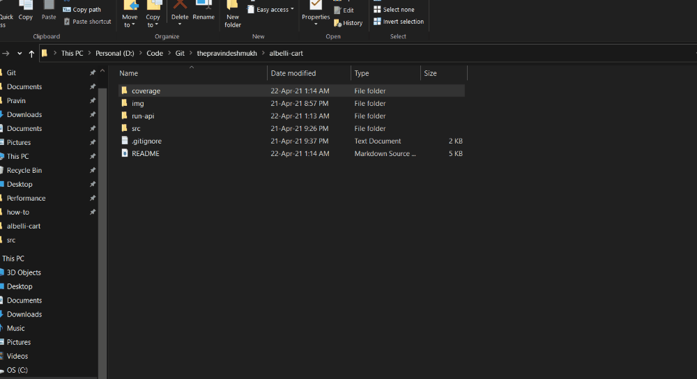
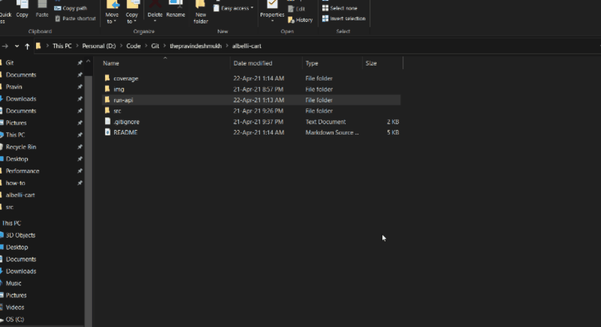
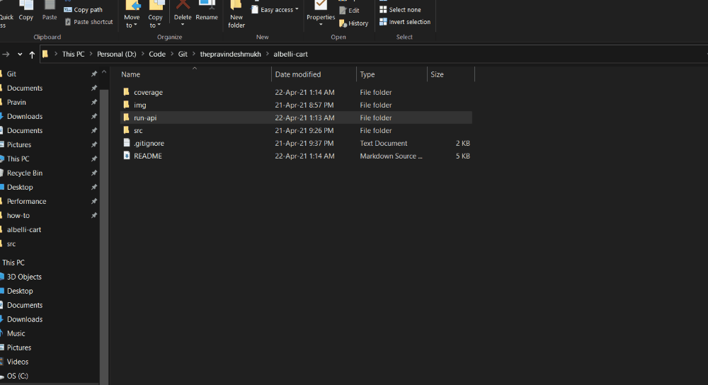

# Albellicart .NET Core GraphQL API

<p align="left">
  <a href="https://github.com/ThePravinDeshmukh/albelli-cart"></a>
</p>

## Quick Start
```
> run-api\via-dotnet-cli.bat
> browse to http://localhost:5000/ui/playground
```

## Planning & Documentation
Confluence - https://techfactor.atlassian.net/l/c/HE5GnM1C

## Tech-Stack

| Component        	| Attribute					| Value  	| Status  | Reference |
| ------------- 	|-------------		| -------------	| ------------- |-------------|
| Web API | Repository | GitHub | Done | https://github.com/ThePravinDeshmukh/albelli-cart |
|  | Framework | dotnet 3.1 | Done | https://dotnet.microsoft.com/download/dotnet/3.1 |
|  | ORM | EF Core | Done | https://docs.microsoft.com/en-us/ef/core/ |
|  | API Querying | GraphQL | Done | https://github.com/graphql-dotnet/graphql-dotnet |
|  | Logging | Serilog | Done | https://docs.microsoft.com/en-us/aspnet/core/fundamentals/logging/?view=aspnetcore-3.1 |
|  | Tests | XUnit with Moq | Done | EF Core Testing https://docs.microsoft.com/en-us/ef/core/testing/ |
|  | Code Coverage | Cobertura | Done | https://docs.microsoft.com/en-us/dotnet/core/testing/unit-testing-code-coverage?tabs=windows |
|  | Service Discovery | Eureka | NOT STARTED | https://steeltoe.io/service-discovery/get-started/eureka |
|  | Code Analysis | EnableNETAnalyzers, EnforceCodeStyleInBuild | Done | https://docs.microsoft.com/en-us/dotnet/fundamentals/code-analysis/overview#code-quality-analysis |
|  | CI | GitHub Actions | Done | https://github.com/ThePravinDeshmukh/albelli-cart/actions |
| Database | In-Memory SQL or NoSql | As confirmed, using In-memory SQL for demonstration. | Done | https://docs.microsoft.com/en-us/ef/core/providers/in-memory/?tabs=dotnet-core-cli |
| Deployment and Runtime | Container | Docker | Done | Run ```run-api\via-docker.bat``` |
|  | Windows | Dotnet core 3.1 runtime | Done | Run ```run-api\via-dotnet-cli.bat``` |


## GraphQL

GraphQL is query language for API.
GraphQL provides a complete and understandable description of the data in your API, gives clients the power to ask for exactly what they need and nothing more, 
makes it easier to evolve APIs over time, and enables powerful developer tools.

https://graphql.org

### Query - Get All Orders

You can open playground localhost:5000/ui/playground and run below query
``` 
query{
  orders
  {
    id
    orderLine
    {
      productType
      quantity
    }
    requiredBinWidth
  }
} 
```

or pass query as argument to /graphql endpoint
``` http://localhost:5000/graphql?query={orders{id,orderLine{productType,quantity}requiredBinWidth}} ```


### Query - Get an Order

You can open playground localhost:5000/ui/playground and run below query
``` 
query{order(id: 1)
  {
    id
    orderLine
    {
      productType
      quantity
    }
    requiredBinWidth
  }
} 
```


or pass query as argument to /graphql endpoint
``` http://localhost:5000/graphql?query={order(id:1){id,orderLine{productType,quantity}requiredBinWidth}} ```

### Mutation - Create an Order

```
mutation($order: [OrderLine]!){
  createOrder(orderlines: $order)
  {
    id,
    requiredBinWidth,
    orderLine
    {
      productType
      quantity
    }
  }
}
```
and add query variables

```
{
  "order": [
    {"productType": "PHOTO_BOOK","quantity": 1},
    {"productType": "CALENDAR","quantity": 2},
    {"productType": "MUG","quantity": 4}
  ]
}
```


The JSON request for this mutation would look like:
```
{
  "query": "mutation ($orderlines:[OrderLine]!){ createOrder(orderlines: $orderlines) { id, requiredBinWidth, orderLine {productType, quantity } } }",
  "variables": {
      "orderlines": [
        {"productType": "PHOTO_BOOK","quantity": 13},
        {"productType": "CALENDAR","quantity": 2},
        {"productType": "MUG","quantity": 7}
      ]
  }
}
```

# How to Generate Coverage Report

You can generate coverage report for solution and view in html

Run
```coverage\generate-report.bat```

This will 

    Run Tests in solution
    Generate coverage report in html
    Open report in browser
	


# How to Run

You can run Web API on target as Windows or in Docker container.

## Docker

    Required - Docker Engine Installed https://docs.docker.com/engine/install/

Run
```run-api\via-docker.bat```



## Windows 
Prerequisite

	Required - Dotnet Core 3.1 SDK  https://dotnet.microsoft.com/download/dotnet/3.1
	Optional - Visual Studio 2019  https://visualstudio.microsoft.com/vs/
Run
```run-api\via-dotnet-cli.bat```


 
